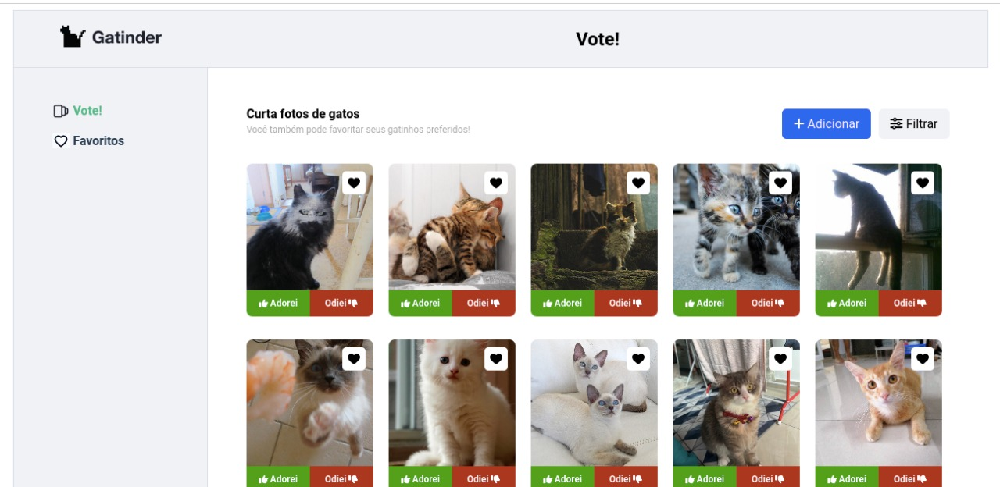

# Galeria de gatos
> Projeto desenvolvido para a seleção de Frontend do CIn/UFPE



## Instalação
### Abra o terminal e execute
```sh
git clone https://github.com/wanderson-r-marques/galeria-com-vue.git
cd galeria-com-vue
npm install 
vue serve
```
### Abra um navegador e digite
```sh
localhost:8080
OBS: A porta 8080 pode alterar caso já esteja sendo utilizada.  
```
